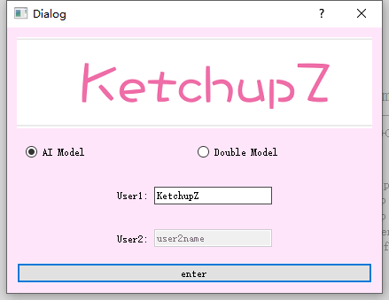
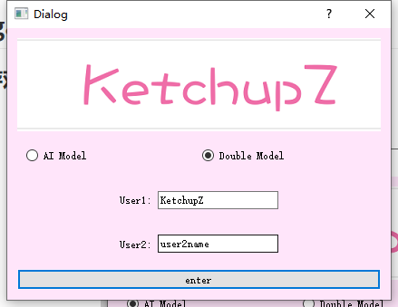
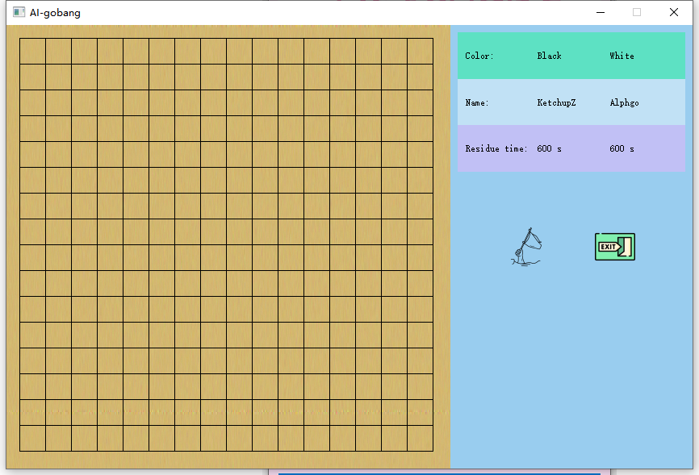
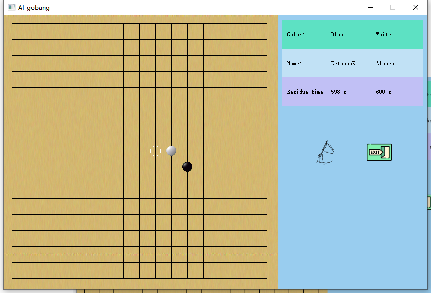
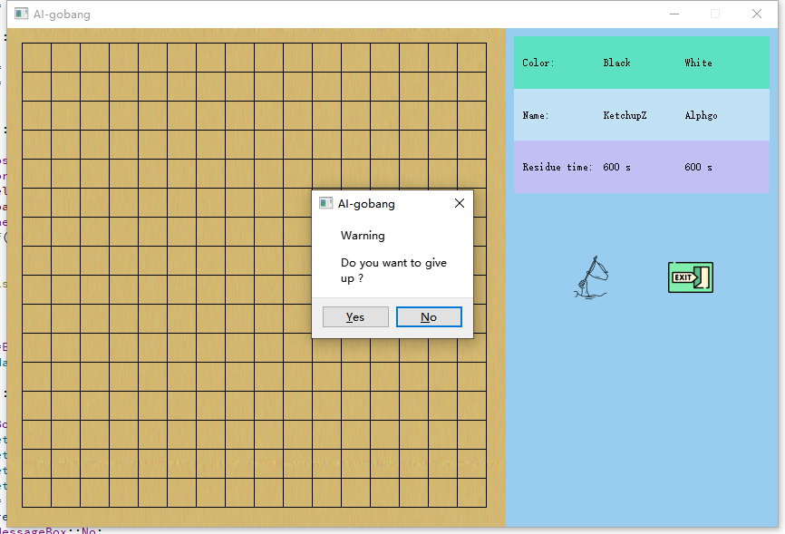
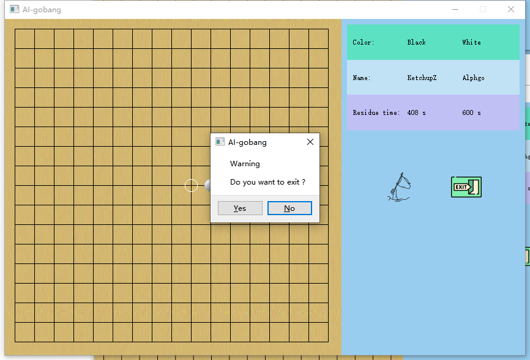
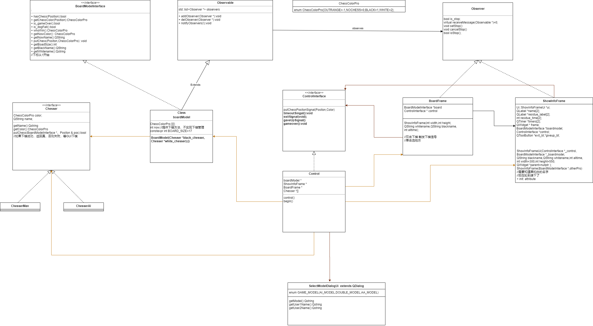
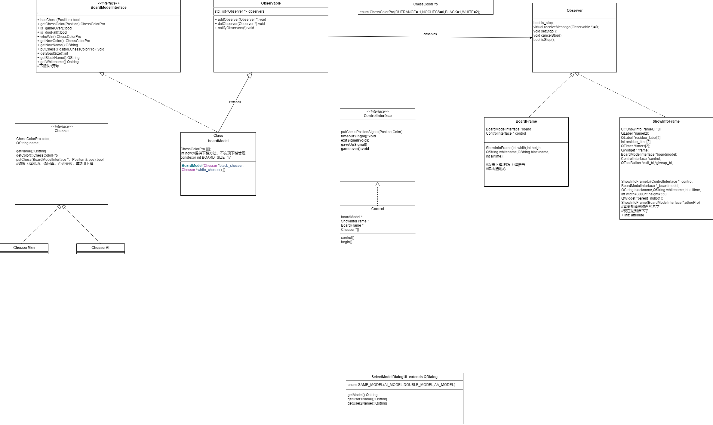

# Gobang-high-

基于QT开发的五子棋，支持双人模式和人机模式（隐藏机机模式）

## introduction

这是基于之前的AI-Gobang项目开发的五子棋，因为之前的AI-Gobang项目没有用任何设计模式的思想，导致程序丝毫没有架构体验。所以这次做Gobang的目的不只是为了改进游戏界面和游戏功能，更重要的是复习学过的设计模式。

AI模式中，AI下棋算法使用的是极大极小值算法，通过枚举每个空闲位置（自己在这个位置和地方在这个位置），计算出获得的势，找出最大势的位置作为下棋位置。

## Usage

项目采用`C++`语言，使用QT库开发，基于的Kits是`Desktop Qt 5.9.9 MSVC2019 64bit`，使用`qmake`构建，`c++`标准为`c++11`。程序入口在`main.cpp`内

## The game picture

### 选择游戏模式

#### AI模式

#### 双人模式

### 游戏界面

#### 游戏界面包含

1. 棋盘界面
2. 投降按钮
3. 退出按钮
4. 玩家游戏剩余时间，玩家昵称，玩家棋子颜色

#### 如何下棋

单击选择将要下棋的位置，双击位置进行下棋。

#### 认输提示

#### 退出提示

#### 其他信息

除了以上结束行为，还有平局，胜利，图片就不展示了。

## Scheme

项目基于MVC设计模式思想进行开发，其中Model包括 `boardModel,ChesserMan,chessAI`，View包括`BoardFrame,ShowInfoFrame,selectModelDialogUi`，Contorl是基于接口`ControlInterface`的`Control` 负责把将Model和View整合到一起，并进行合作。

#### 类关系图

类关系中的的类属性和方法只写出了提供给外部类的公用函数和接口。

#### 类关系图2(去除包含关系)

## final

项目经验少，对设计模式难免有不太理解的地方，所以项目在架构上还有可以改进的地方，但是感觉改了之后不会有多大效果，就没继续做了，再者这个项目目的只是用来温习设计模式的。

感觉这个架构可以框进其他类型的棋盘游戏，比如象棋，跳棋等等。
